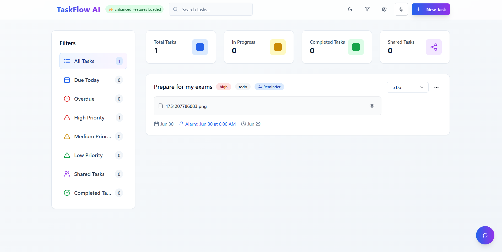
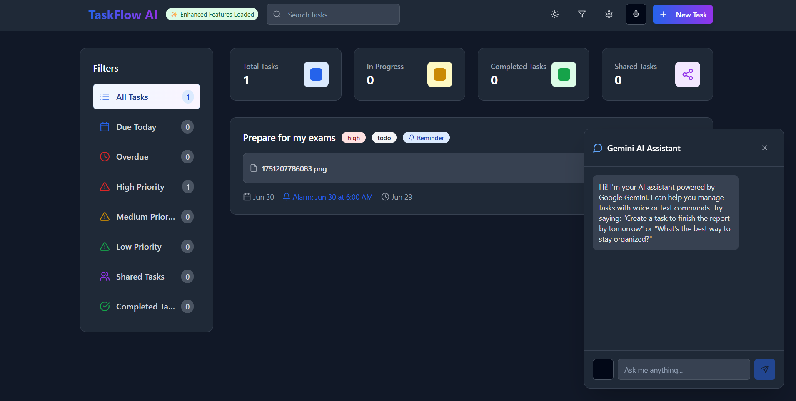
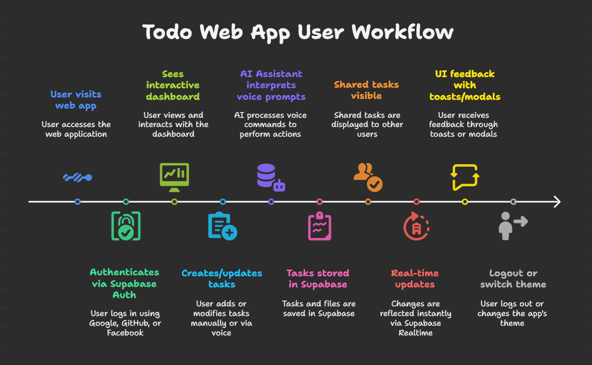

# ✅ AI-Powered Todo Task Management App

A full-stack productivity application where users can manage their personal and shared tasks. It features social authentication, voice command input, and AI assistant integration using Google Gemini for natural interaction.

---

## 🚀 Features

- 🌐 OAuth Authentication (Google, GitHub)
- ✅ Full CRUD operations for tasks
- 📤 Share tasks with others
- 🔄 Real-time updates via Supabase Realtime
- 🔍 Filter tasks (due today, overdue, priority, etc.)
- 🧠 AI Assistant (Gemini API) for voice-based task deletion and future smart CRUD
- 🎙️ Voice command support using Web Speech API
- ☁️ Attach files via Supabase Storage
- 📱 Fully responsive for desktop + mobile
- 🌗 Dark mode toggle

---

 How It looks(Lite mode)



 How It looks(Dark mode)



## 🛠️ Tech Stack

| Layer       | Tech                                         |
|-------------|----------------------------------------------|
| Frontend    | React, Vite, Tailwind CSS, Web Speech API    |
| Backend     | Supabase (Auth, DB, Storage, Realtime)       |
| AI Assistant| Google Gemini API (prompt → JSON)            |
| Hosting     | Vercel (frontend), Supabase (backend + DB)   |
| Storage     | Supabase Storage for file attachments        |

---

## ⚙️ How It Works (Workflow Diagram)

 <!-- Replace with actual exported image or link -->

---

## 🧱 Architecture Diagram

 <!-- Replace with actual exported image or link -->

---

## 🔐 Authentication

- Social login with OAuth 2.0
- Provider options:
  - ✅ Google
  - ✅ GitHub
  - ✅ Facebook
- Managed securely via Supabase Auth
- JWT session storage

---

lite mode

## 📡 Real-Time Updates

- Task changes are synced in real-time using Supabase’s built-in websocket layer.
- No page refresh required for updates.

---

## 🎯 Current AI Capability

- ✅ Task deletion using voice or text via Gemini AI
- 🛠️ Future: Smart create/update tasks from freeform voice input

---

## 🧪 Assumptions

- Voice commands must be supported in browser
- AI assistant is currently partially implemented (delete only)
- Users must allow mic access for voice control
- Only shared tasks marked by the user are available to others

---

## 📦 Deployment

- 🔗 Live: [LIVE_LINK](https://task-flow-seven-hazel.vercel.app/)
- 🔗 GitHub: [GITHUB_REPO](https://github.com/DharanidharanKK/TaskFlow)


## 🏁 Setup Instructions

1. Clone the repo:
```bash
git clone https://github.com/your-username/todo-ai.git

